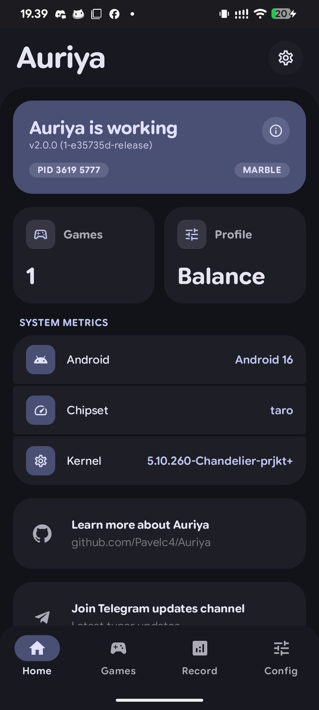
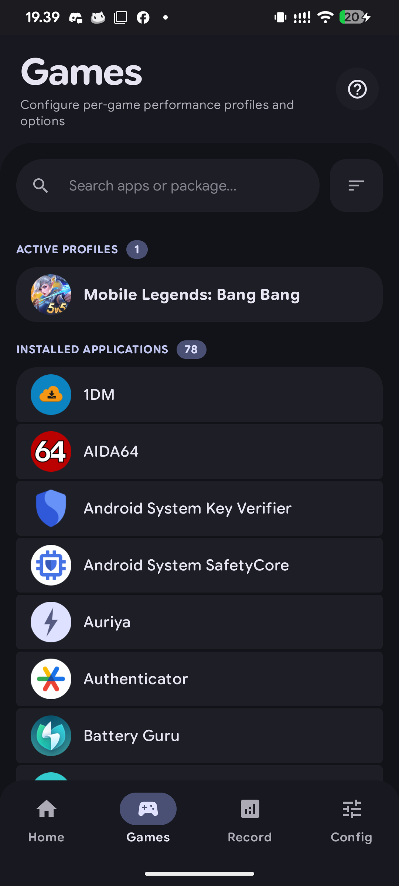
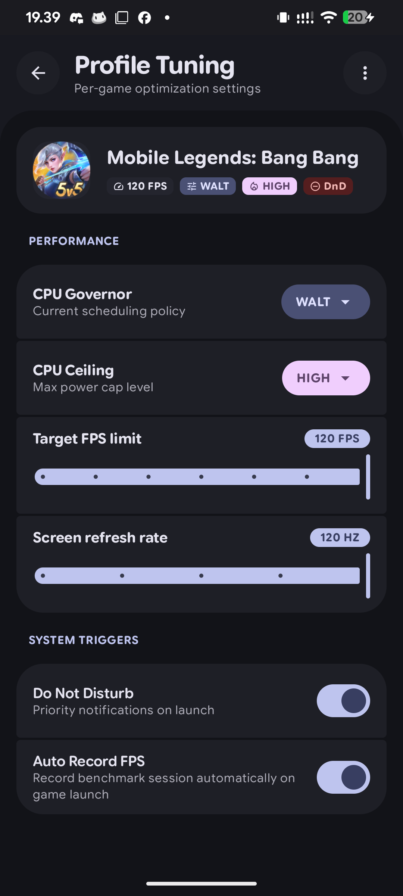
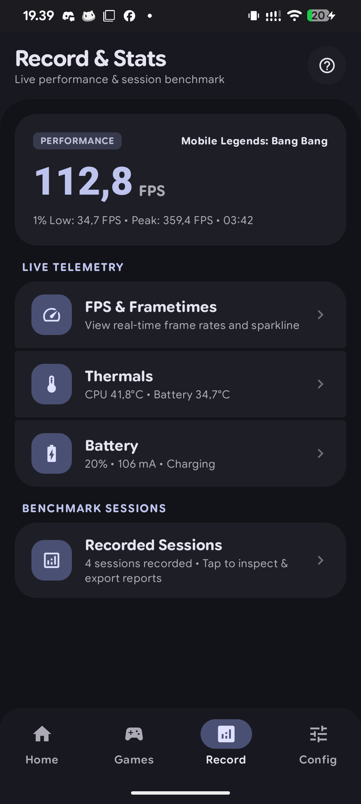
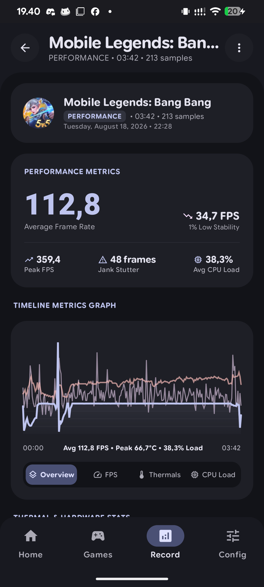
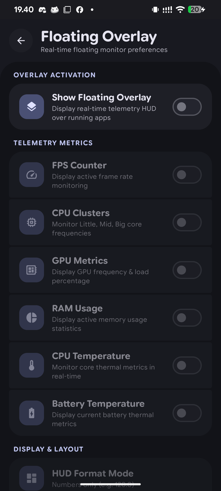
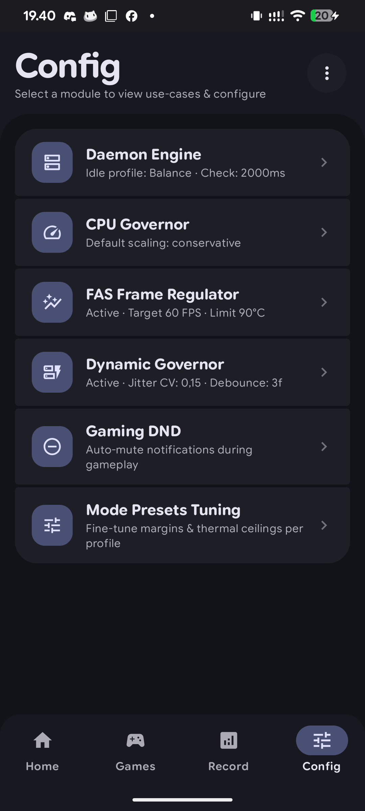
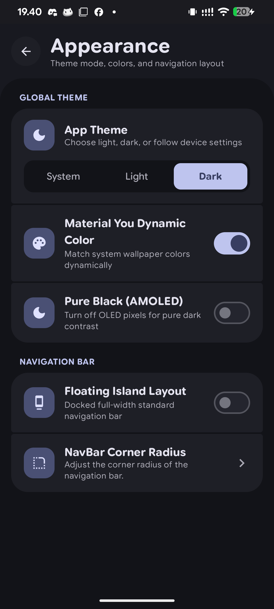
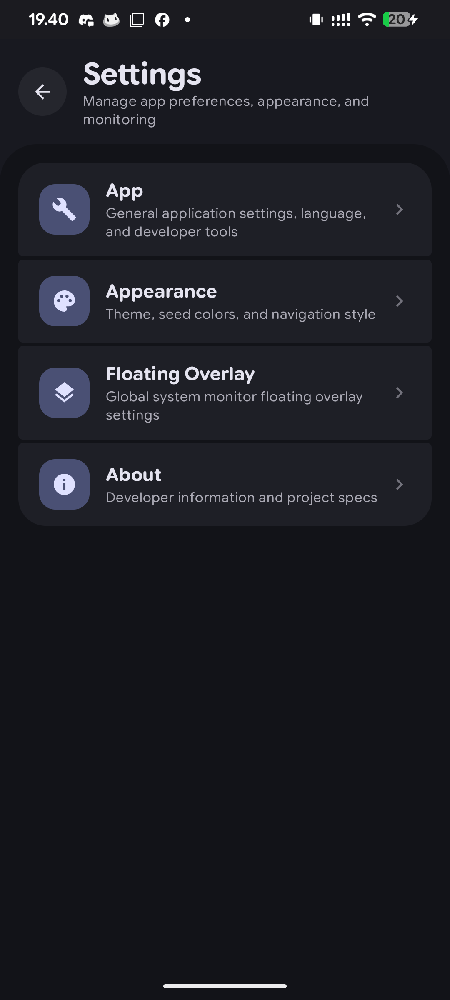

## About Auriya
**Auriya** is a rooted Android performance optimization daemon written in Rust, paired with a modern Jetpack Compose manager application and companion service.

Visit the [Official Documentation & Wiki](https://auriya.pages.dev) *(available in English and Bahasa Indonesia)* for detailed guides and configuration references.

## Features
- **Rust Native Daemon** — Runs in the background to handle system tweaks, performance tuning, and profile switching.
- **Dynamic Frame-Aware Scheduling** — Automatically boosts CPU performance when frames drop and saves battery when gameplay is smooth.
- **Per-Game Custom Profiles** — Set custom target FPS, screen refresh rate, CPU modes, and auto Do Not Disturb for each game.
- **Live Benchmark & FPS Recording** — Monitor real-time FPS, temperature, and battery drain, with session recording to review gaming stability.
- **Manager App & Floating Overlay** — Easy-to-use Android app to customize settings, plus a floating on-screen HUD to view live FPS while playing.
- **Command-Line Tools (`auriyactl`)** — Quick terminal commands to check status and switch profiles on the fly.

## Screenshots
| Home | Games | Tuning |
| :---: | :---: | :---: |
|  |  |  |

| Telemetry | Benchmark | Floating HUD |
| :---: | :---: | :---: |
|  |  |  |

| Domain Config | Customization | Settings |
| :---: | :---: | :---: |
|  |  |  |

## Documentation
Comprehensive architectural deep-dives, configuration guides, and references are available on the documentation website:
- [Getting Started & Installation](https://auriya.pages.dev/getting-started/installation/)
- [Configuration & Profiles](https://auriya.pages.dev/getting-started/configuration/)
- [Telemetry Protocol & FPS Benchmark API](https://auriya.pages.dev/reference/stats-api/)
- [Architecture & Data Flow](https://auriya.pages.dev/architecture/overview/)
- [Dokumentasi Bahasa Indonesia](https://auriya.pages.dev/id/)

## Supported Root Managers
- [Magisk](https://github.com/topjohnwu/Magisk)
- [KernelSU](https://github.com/tiann/KernelSU)
- [APatch](https://github.com/bmax121/APatch)

## Resources
- [Documentation Website](https://auriya.pages.dev)
- [Releases](https://github.com/pavelc4/auriya/releases) - Download latest flashable ZIP
- [Changelog](CHANGELOG.md) - Version history
- [Issues](https://github.com/pavelc4/auriya/issues) - Report bugs

## Support 🌸
If you find Auriya useful for your device, please consider giving the repository a star ⭐ on GitHub to support the project.

## License
Auriya is open-sourced software licensed under the [GNU General Public License v3.0](LICENSE).
