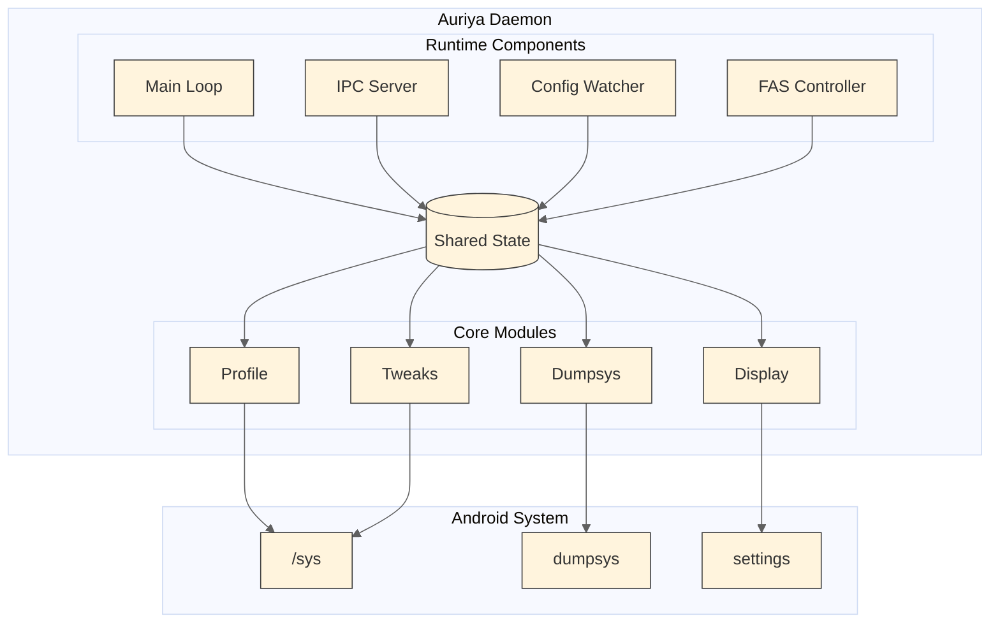
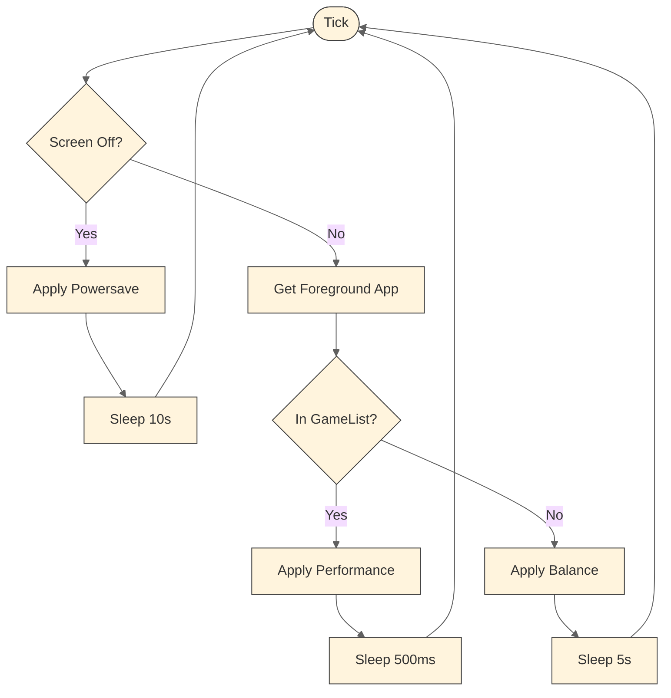
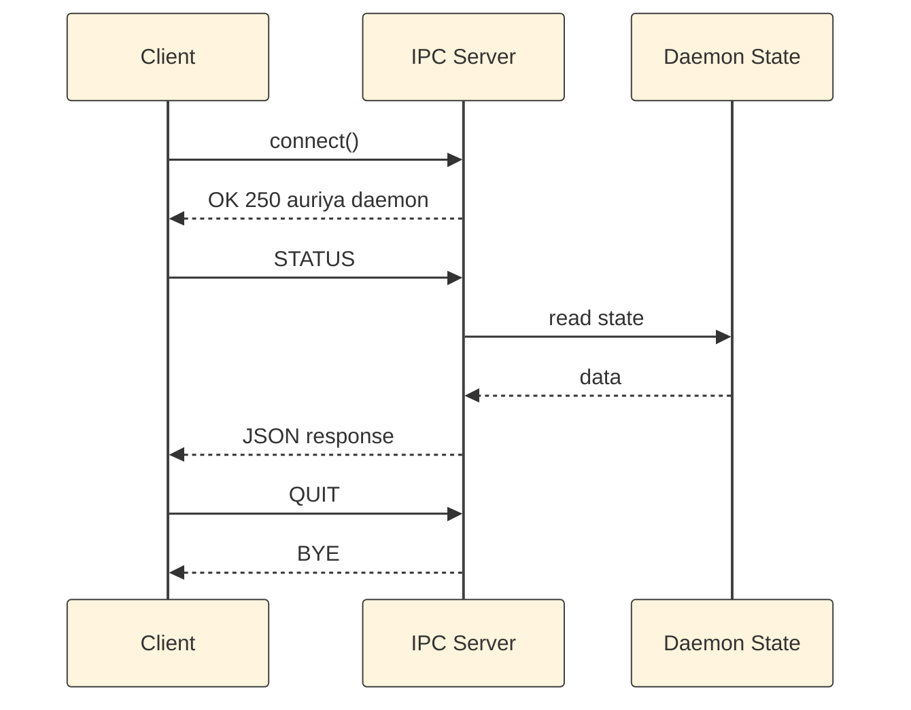
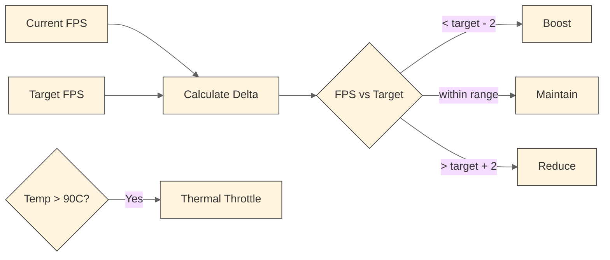
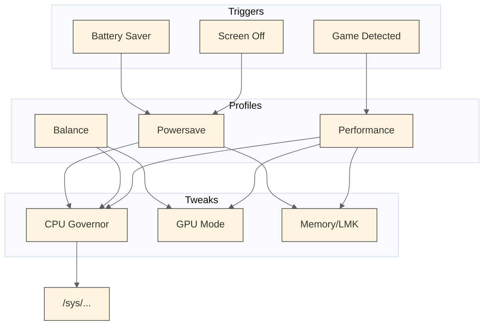
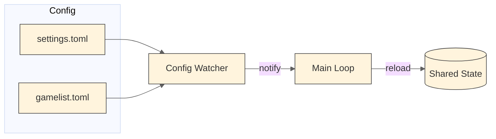

# Architecture

This document describes the internal architecture of Auriya daemon, including component design, data flow, and system interactions.

## Table of Contents

- [System Overview](#system-overview)
- [Component Architecture](#component-architecture)
- [Module Structure](#module-structure)
- [Data Flow](#data-flow)
- [Profile System](#profile-system)
- [Design Decisions](#design-decisions)

## System Overview

Auriya runs as a userspace daemon that monitors Android system state and applies settings based on foreground application detection.



## Component Architecture

### Main Loop (Tick Engine)

**Purpose:** Coordinates periodic system state checks and profile application.

**Responsibilities:**

- Fetch power state (screen awake, battery saver)
- Detect foreground application via dumpsys
- Match foreground app against game whitelist
- Trigger profile application on state changes
- Execute FAS controller ticks during game sessions

**Adaptive Polling Intervals:**

| System State     | Interval | Rationale                         |
| ---------------- | -------- | --------------------------------- |
| In-Game          | 500ms    | Fast response for FAS adjustments |
| Screen On (Idle) | 5000ms   | Low overhead during normal usage  |
| Screen Off       | 10000ms  | Battery conservation              |

**Instant Wake Detection:**

The daemon always fetches power state when the previous state indicates screen-off. This enables immediate profile switching upon screen wake without increasing polling frequency during normal operation.



---

### IPC Server

**Purpose:** Provides external control interface via Unix domain socket.

**Responsibilities:**

- Accept client connections on `/dev/socket/auriya.sock`
- Parse text-based commands
- Execute command handlers
- Return JSON responses

**Protocol:**

- Transport: Unix domain socket
- Format: Line-delimited text commands, JSON responses
- Authentication: Socket permissions (0660)

**Connection Flow:**



---

### Config Watcher

**Purpose:** Monitors configuration files for changes and triggers reload.

**Responsibilities:**

- Watch `/data/adb/.config/auriya/settings.toml` for changes
- Watch `/data/adb/.config/auriya/gamelist.toml` for changes
- Notify main loop on file modifications
- Debounce rapid file changes

**Implementation:**

- Watches file changes automatically
- Notifies main loop when config files are modified
- Main loop receives and processes reload requests

---

### FAS Controller

**Purpose:** Implements Frame-Aware Scheduling for adaptive performance scaling.

**Responsibilities:**

- Monitor current frame rate via SurfaceFlinger
- Compare against target FPS configuration
- Calculate scaling action (Boost/Maintain/Reduce)
- Respect thermal thresholds

**Algorithm:**

FAS works by comparing the current FPS with the target FPS:



Simple: If FPS is too low → boost performance, if FPS is too high → save power.

---

## Module Structure

```
src/
├── main.rs                     # Entry point, runtime initialization
│
├── core/                       # Core business logic
│   ├── mod.rs                  # Module exports
│   ├── cmd.rs                  # Shell command execution
│   ├── display.rs              # Refresh rate control
│   ├── profile.rs              # Profile application (Perf/Balance/Powersave)
│   ├── scaling.rs              # Scaling action types
│   ├── thermal.rs              # Thermal monitoring
│   │
│   ├── config/                 # Configuration management
│   │   ├── mod.rs              # Config types and loading
│   │   ├── path.rs             # Config path constants
│   │   ├── settings.rs         # settings.toml parsing
│   │   └── gamelist.rs         # gamelist.toml parsing
│   │
│   ├── dumpsys/                # Android dumpsys integration
│   │   ├── mod.rs              # Module exports
│   │   ├── activity.rs         # App PID detection
│   │   ├── foreground.rs       # Foreground package detection
│   │   ├── power.rs            # Screen and battery state
│   │   └── surfaceflinger.rs   # Frame rate detection
│   │
│   ├── fas/                    # Frame-Aware Scheduling
│   │   ├── mod.rs              # FAS types
│   │   ├── buffer.rs           # Frame buffer implementation
│   │   └── source.rs           # FPS data source
│   │
│   └── tweaks/                 # System optimizations
│       ├── mod.rs              # Module exports
│       ├── cpu.rs              # CPU governor, boost, affinity
│       ├── gpu.rs              # GPU performance modes
│       ├── memory.rs           # LMK, swappiness, caches
│       ├── paths.rs            # Cached sysfs paths
│       ├── sched.rs            # Scheduler tuning
│       ├── storage.rs          # Storage frequency control
│       ├── init.rs             # General system tweaks
│       └── vendor/             # Vendor-specific optimizations
│           ├── mod.rs
│           ├── detect.rs       # SoC detection
│           ├── mtk.rs          # MediaTek tweaks
│           └── snapdragon.rs   # Snapdragon tweaks
│
└── daemon/                     # Daemon runtime
    ├── mod.rs                  # Module exports
    ├── config.rs               # DaemonConfig struct
    ├── state.rs                # CurrentState, LastState
    ├── run.rs                  # Main daemon struct and loop
    ├── tick.rs                 # Tick logic implementation
    ├── watcher.rs              # Config file watcher
    ├── fas.rs                  # FAS controller wrapper
    │
    └── ipc/                    # IPC subsystem
        ├── mod.rs              # Module exports
        ├── server.rs           # Socket server
        ├── commands.rs         # Command parsing
        └── handlers.rs         # Command handlers
```

### Directory Descriptions

**src/core/**

Contains domain logic independent of daemon runtime. All performance tuning, system interaction, and configuration parsing resides here.

Key files:

- `profile.rs`: Implements Performance, Balance, and Powersave profile application
- `display.rs`: Controls display refresh rate via surface_flinger

**src/core/tweaks/**

System optimization implementations organized by subsystem.

Key files:

- `cpu.rs`: CPU governor control, core affinity, process priority
- `paths.rs`: Cached sysfs paths for zero-allocation hot paths
- `memory.rs`: LMK tuning, swappiness, cache management

**src/core/dumpsys/**

Android system state detection via dumpsys command parsing.

Key files:

- `foreground.rs`: Extracts current foreground package
- `power.rs`: Detects screen state and battery saver mode
- `activity.rs`: Retrieves application PID

**src/daemon/**

Daemon runtime, event loop, and IPC server implementation.

Key files:

- `run.rs`: Main Daemon struct and event loop
- `tick.rs`: Per-tick processing logic
- `ipc/commands.rs`: IPC command definitions and parsing

---

## Data Flow

### Profile Application Flow



### Configuration Reload Flow



---

## Profile System

### Performance Profile

Applied when a whitelisted game runs in foreground.

| Component        | Action                                         |
| ---------------- | ---------------------------------------------- |
| CPU Governor     | Set to configured value (default: performance) |
| CPU Boost        | Enabled                                        |
| CPU Cores        | All cores online                               |
| CPU Affinity     | Game PID pinned to big/prime cores             |
| Process Priority | Game PID set to -20 (highest)                  |
| GPU              | Performance mode                               |
| Scheduler        | Performance tuning                             |
| Storage          | Frequency locked                               |
| Memory           | Game optimizations, drop caches                |
| Notifications    | Heads-up disabled (DND)                        |

### Balance Profile

Applied during normal usage with no game in foreground.

| Component     | Action                                       |
| ------------- | -------------------------------------------- |
| CPU Governor  | Set to configured value (default: schedutil) |
| CPU Boost     | Disabled                                     |
| GPU           | Balanced mode                                |
| Scheduler     | Balanced settings                            |
| Storage       | Frequency unlocked                           |
| Memory        | Normal settings                              |
| Notifications | Restored                                     |

### Powersave Profile

Applied when screen is off or battery saver is active.

| Component     | Action            |
| ------------- | ----------------- |
| CPU Governor  | powersave         |
| LMK           | Aggressive tuning |
| Notifications | Restored          |

---

## Design Decisions

### Cached Sysfs Paths

**Context:** Profile switching writes to multiple sysfs files for CPU governor control. Each write previously required path existence checks.

**Decision:** Cache valid sysfs paths at daemon startup.

**Rationale:**

- Reduces memory allocations per profile switch
- Removes repeated file checks

**Consequences:**

- Positive: Fewer allocations in hot path
- Negative: Paths cached at startup; CPU hotplug after daemon start not detected

### Wake Detection

**Context:** Screen wake had delay before profile switch due to staggered power state polling.

**Decision:** Fetch power state when previous state indicates screen-off.

**Rationale:**

- No additional cost during normal screen-on operation
- Detects screen wake transition quickly
- Maintains 10-second polling during screen-off

**Consequences:**

- Positive: Faster profile switch on screen wake
- Negative: None identified

### Single-Threaded Async Runtime

**Context:** Choosing between multi-threaded and single-threaded tokio runtime.

**Decision:** Use `current_thread` flavor tokio runtime.

**Rationale:**

- Simpler debugging and reasoning
- Lower memory footprint
- Sufficient for IO-bound daemon workload
- Avoids synchronization overhead

**Consequences:**

- Positive: Reduced memory usage, simpler code
- Negative: CPU-bound tasks must use spawn_blocking
